# Zarządzanie obrazami i kontenerami

Zrozumienie podstaw działania obrazów i kontenerów jest krytycznie ważne do ich efektywnego wykorzystania w projektach Data Science. Poniżej przedstawimy kilka kluczowych koncepcji, ilustrując je prostymi przykładami.

## Zarządzanie obrazami

Najczęściej pierwszym krokiem w procesie tworzenia nowego obrazu jest zgromadzenie w jednym miejscu odpowiednich plików z danymi oraz skryptów oraz przetestowanie ich poprawnego działania.

W kolejnym kroku tworzymy plik Dockerfile, specyfikując zakres i konfigurację uruchamiania obrazów.

W naszym przykładzie zaczniemy od następującego pliku Dockerfile:

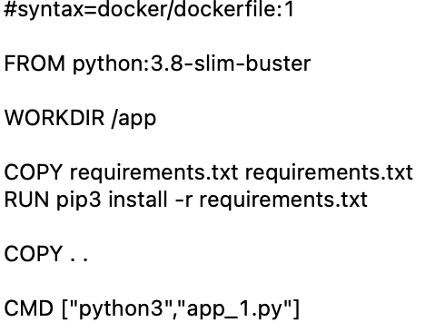

Obraz tworzymy komendą:

`docker build -t app1:v1 .`

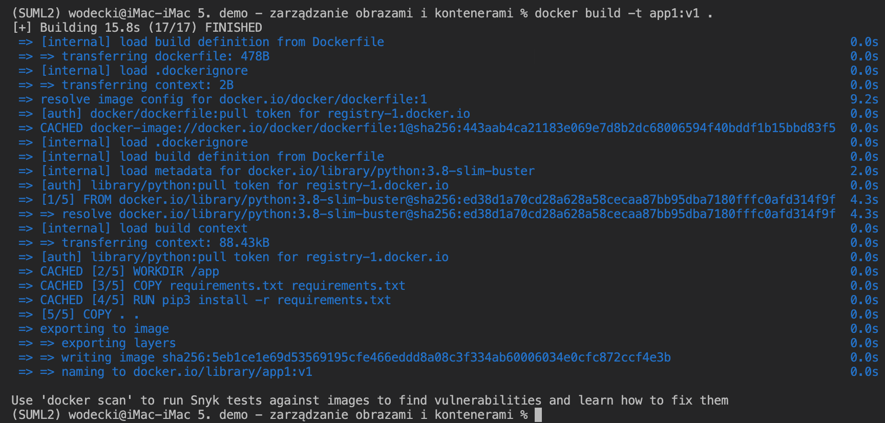

Możemy teraz sprawdzić, czy nowy obraz pojawił się w systemie, korzystając z komendy (wykorzystujemy to przekierowanie potoku do funkcji `grep` po to, by pokazać wyłącznie obrazy o nazwie `app1`) :

`docker images | grep app1`

Jak widać, nowy obraz pojawił się w naszym systemie.

Obrazy możemy też usuwać (`docker images rm <ID kontenera>`), zmieniać ich nazwę, etc.

## Zarządzanie kontenerami

Komenda:

`docker ps`

wyświetla wszystkie **aktualnie uruchomione** kontenery. 

Aby zobaczyć wszystkie kontenery w systemie, również te zatrzymane, trzeba uruchomić tę komendę z flagą -a:

`docker ps -a`

Uruchomienie tych dwóch komend w "czystym" systemie powinno zwrócić pusty wynik.

Zobaczmy, co się stanie, gdy uruchomimy nasz obraz wykorzystując komendę:

`docker run -ti app1:v1`

Program uruchamia się poprawnie:
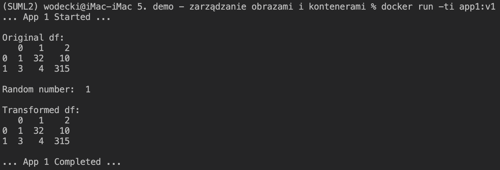

Komenda `docker ps` zwraca pusty wynik, ale już `docker ps -a` wyświetla na ekranie:

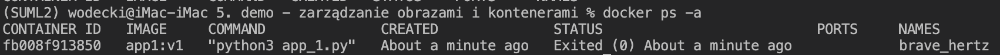

Jak widać, **kontener po uruchomieniu się zatrzymał**: nie jest już aktywny (pusty komunikat `docker ps`), ale istnieje w repozytorium kontenerów. 

Dzieje się tak dlatego, że w ostatniej linii naszego pliku Dockerfile wywołaliśmy komendę *CMD ["python3","app_1.py"]* uruchamiającą skrypt Python: kontener po poprawnym wykonaniu skryptu otrzymuje sygnał do zatrzymania. Brak tej komendy:

1. Z jednej strony nie uruchamiałby skryptu app_1.py. Jego uruchomienie byłoby możliwe jedynie "z wnętrza" kontenera
2. ... ale z drugiej nie zatrzymuje działania kontenera.

Spróbujmy teraz uruchomić kontener ponownie, wykorzystując w tym celu jeszcze raz komendę:

`docker run -ti app1:v1`

Tak, jak poprzednio komenda `docker ps` zwraca pusty wynik, ale `docker ps -a` wyświetla na ekranie:

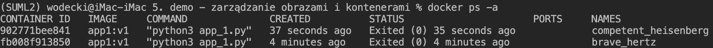

Wynika z tego, że **efektem ponownego uruchomienia kontenera komendą `docker run ...` było utworzenie nowego kontenera.**

Wynika z tego istotna obserwacja: **wielokrotne korzystanie z funkcji `docker run ...` generuje wiele kontenerów, osobny dla każdego z uruchomień.**

Po pewnym czasie kontenerów może być tak dużo, że konieczne jest ich usunięcie. Można to zrobić "ręcznie" korzystając z komendy `docker container rm <ID kontenera>`:

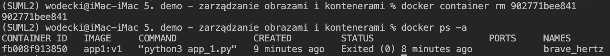

W ekstremalnej wersji można też skorzystać z komendy `docker container prune` usuwającej wszystkie kontenery.

## Uruchamianie zatrzymanych kontenerów

Aby **uruchomić ponownie zatrzymany kontener**, uruchom:

`docker container start <ID kontenera>`:

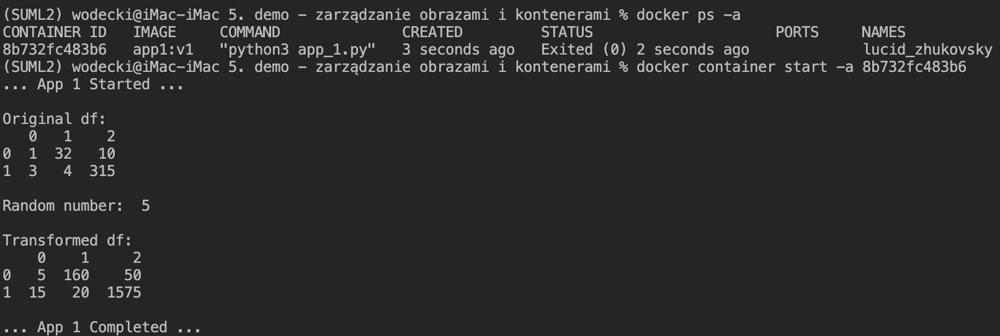

Wykorzystaliśmy tu flagę -a (attach), aby móc wyświetlić komunikaty z kontenera.

Tak, jak poprzednio, po uruchomieniu jest on zatrzymywany, **a wszystkie generowane przez niego dane tracone.** O tym, jak je zachować, opowiemy w części poświęconej wymianie plików pomiędzy kontenerami a hostem.

## Uruchamianie komendy wewnątrz uruchomionego kontenera

Do uruchomienia komendy wewnątrz kontenera można wykorzystać komendę EXEC:

`docker exec -ti <ID kontenera> COMMAND`

Uwaga: przykład poniżej pokazuje, że **jest to możliwe wyłącznie w sytuacji, gdy kontener jest uruchomiony**: 

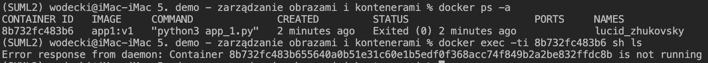

Jak spowodować, aby nasz kontener nie był zamykany bezpośrednio po uruchomieniu?

Pierwszą z opcji przedstawiliśmy powyżej: w**ystarczy, aby nasz Dockerfile nie zawierał na końcu komendy uruchamiającej skrypt**, jak na przykładzie poniżej:

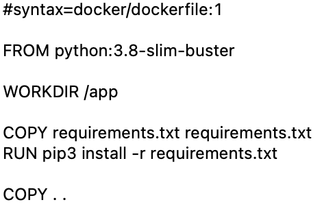

Inna możliwość to **uruchomienie kontenera z komendą bash na końcu linii komendy**:

`docker run -ti app1:v1 bash`

Dzięki niej uruchamiamy kontener i otrzymujemy dostęp do jej powłoki bash. Będąc w niej, możemy uruchomić nasz skrypt, przeglądać i modyfikować pliki, etc.:

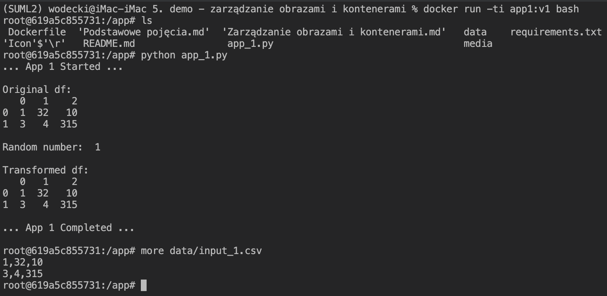

Tym razem już komenda `docker ps` wskazuje, że nasz kontener jest aktywny:

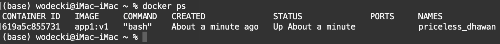

W efekcie, można już w nim uruchamiać różne programy wykorzystując komendę `exec`:

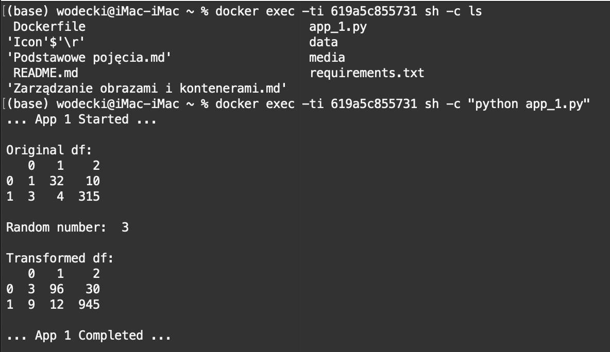

Jest to o tyle wygodne, że **po każdym takim uruchomieniu wracam do naszej lokalnej powłoki**. Może mieć to bardzo ciekawe zastosowania w uruchomienia produkcyjnej (zarządzanie uruchamianiem kontenerów poprzez skrypty powłoki).

## Zarządzanie obrazami i kontenerami z wykorzystaniem aplikacji Docker Desktop oraz IDE

Linia komend to nie jedyny sposób na inspekcję i zarządzanie obrazami i kontenerami. Można do tego z powodzeniem wykorzystać:

1. Aplikację Docker Desktop:
   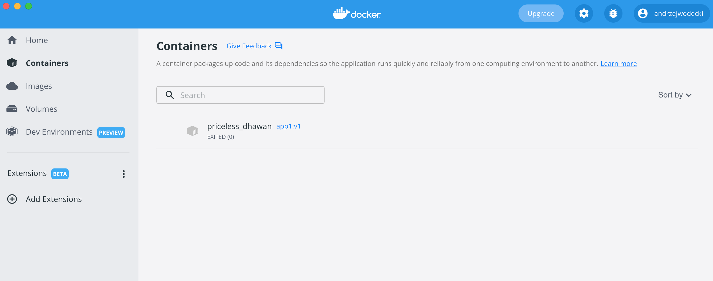
2. Środowisko IDE, np. MS Visual Studio Code:
   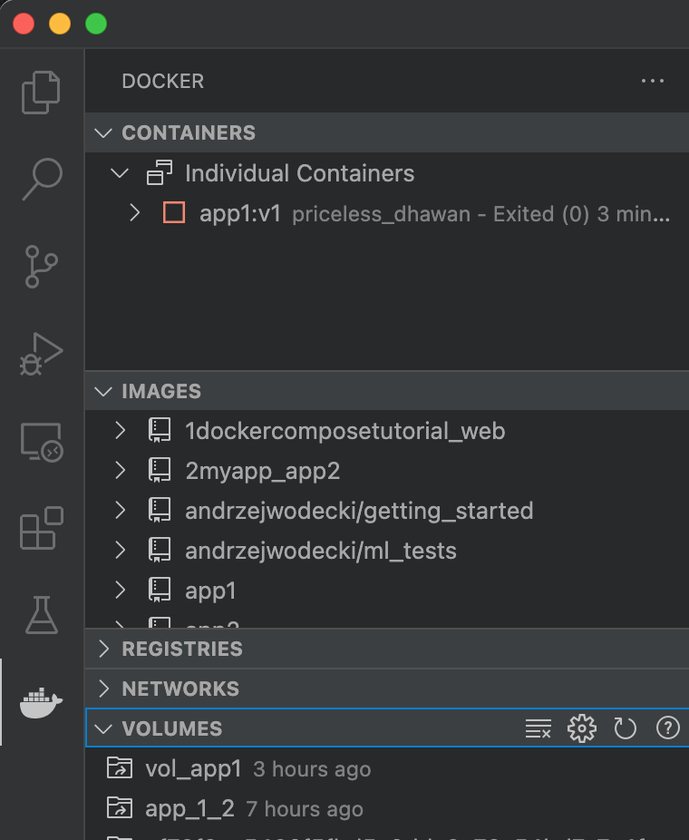

