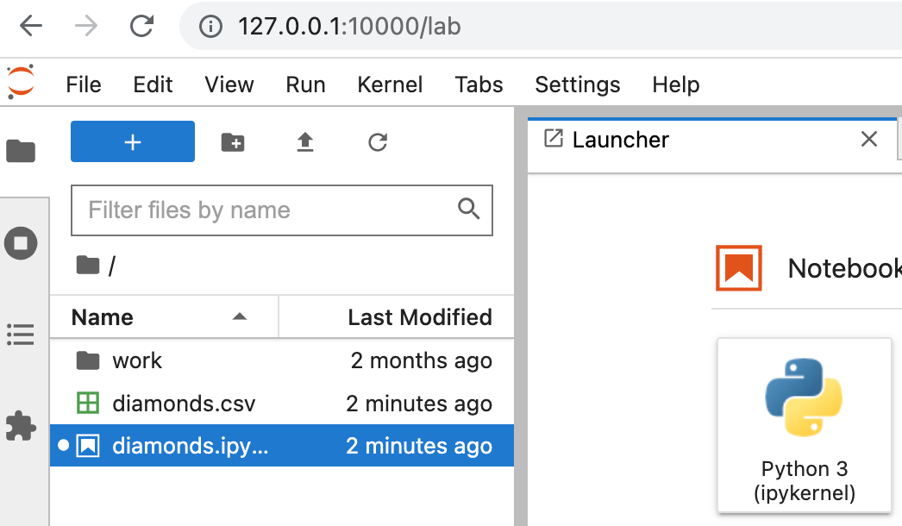

<iframe width="560" height="515" src="https://www.youtube.com/embed/IQo5p8-73ZY" title="YouTube video player" frameborder="0" allow="accelerometer; autoplay; clipboard-write; encrypted-media; gyroscope; picture-in-picture" allowfullscreen></iframe>

# Uruchomienie gotowego kontenera z notatnikiem Jupyter i środowiskiem DataScience

...

# Instrukcje

1. W linii komend uruchom:

`$ docker run -p 10000:8888 jupyter/scipy-notebook:6b49f3337709`

2. W przeglądarce wejdź na stronę:

`http://127.0.0.1:10000/`

3. W interfejsie Jupyter Lab, kliknij + (lewy górny róg):
   

aby dodać z własnego dysku pliki `diamonds.ipynb` i `diamonds.csv`

4. Uruchamiaj poszczególne komendy notatnika. Jak widać, komplet niezbędnych bibliotek jest już dostępny.

# Przydatne źródła

Opis publikowania portów z kontenera do hosta lokalnego (flaga `-p` (lub `--publish`) w poleceniu `docker run` powyżej) znajdziesz [tutaj](https://docs.docker.com/engine/reference/commandline/run/#publish-or-expose-port--p---expose).

