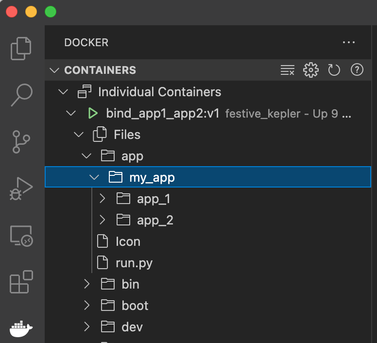

# Stworzenie kontenera udostępniającego wyłącznie środowisko uruchomieniowe

Najprostszym scenariuszem użycia kontenera Docker jest udostępnienie w nim wyłącznie środowiska uruchomieniowego. Komplet plików niezbędnych do uruchomienia aplikacji powinien znajdować się w systemie lokalnych (host'a).

## Budowa obrazu

Stwórz obraz:

`docker build -t bind_app1_app2:v1 . `

Uruchom obraz bez podłączania lokalnego wolumenu:

`docker run -ti bind_app1_app2:v1`

Zauważ, że:

1. po uruchomieniu kontenera automatycznie uruchamia się środowisko python
1. w środowisku tym zainstalowany jest pakiet pandas: komenda `import pandas as pd` nie generuje błędu.

## Kopiowanie plików host-kontener z wykorzystaniem linii komend

Aby móc wykorzystać tak skonfigurowane środowisko w praktyce, należy przekazać do niego pliki. W tym celu możesz wykorzystać komendę `docker cp`.

`docker cp ...` umożliwia kopiowanie plików pomiędzy uruchomionym kontenerem a systemem lokalnym. Przyjmuje ona tylko jeden argument po stronie "źródła", dlatego też dobrą praktyką jest zgromadzenie wszystkich plików i folderów w jednym katalogu (w naszym przypadku *my_app*), a potem skopiowanie go w całości do kontenera. Drugim parametrem jest miejsce docelowe: ID kontenera oraz jego folder docelowy.

Kompletna procedura z wykorzystaniem linii komend wygląda następująco:

1. W nowym terminalu uruchom kontener:
   `docker run -ti bind_app1_app2:v1 bash`
2. Sprawdź jego ID:
   `docker ps`
3. Przejdź do folderu lokalnego, w którym znajduje się folder, który chcesz skopiować. U mnie: katalog, w którym znajduje się folder *my_app/*
4. Uruchom w tym folderze kolejny terminal i wpisz w nim komendę:
   `docker cp my_app 111ac631710c:/app`
   UWAGA: zamień *111ac631710c* na ID własnego kontenera
5. W terminalu z uruchomionym kontenerem:
   1. Sprawdź komendą `ls` , czy Twój folder poprawnie się skopiował
   2. Wejdź do niego i uruchom skrypt:
      `python3 run.py`

## Kopiowanie plików host-kontener z wykorzystaniem wtyczki Docker w IDE (np. MS Visual Studio Code)

W praktyce często wygodniejszym rozwiązaniem jest wykorzystanie środowiska IDE do operacji na plikach w aktywnych kontenerach. W szczególności, MS Visual Studio Code udostępnia możliwości inspekcji i zarządzania obrazami, kontenerami i wolumenami (wtyczka Docker). 

