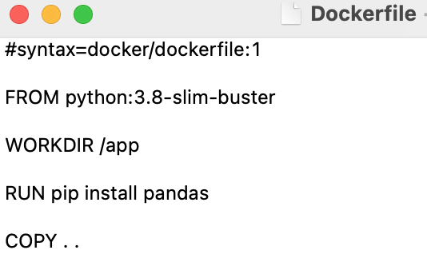

# Uruchomienie bez podłączania lokalnego systemu plików

Jeśli chcemy przekazać komuś kontener z kompletem niezbędnych plików (tak, by mógł uruchomić kompletny proces bez konfiguracji zarówno środowiska, jak i posiadania niezbędnych plików), możemy w pliku *Dockerfile* skopiować komplet plików do odpowiedniego katalogu w obrazie. Odpowiada za to komenda `COPY . .` :

Aby stworzyć obraz:

1. przejdź do folderu, w którym masz komplet niezbędnych danych
2. uruchom w nim terminal, a w nim komendę:
   `docker build -t bind_app1_app2:v2 . `

Tak stworzony obraz możesz uruchomić w dowolnym katalogu - nie musisz mieć w nim dostępu do niezbędnych plików:

`docker run -ti bind_app1_app2:v2 python3 run.py`

Zauważ, że:

1. na końcu komendy dodaliśmy `python3 run.py`. Jest to związane z tym, że zgodnie z plikiem Dockerfile nasz obraz nie uruchamia skryptu `run.py`
2. uruchomienie w folderze, w którym nie ma niezbędnych plików, nie generuje błędów
3. kolejne uruchomienia nie dodają żadnych plików do lokalnego systemu.

## Scenariusze użycia

Wyżej wymieniony mechanizm możesz w szczególności zastosować w następujących sytuacjach:

### Udostępnianie

**Chcę udostępnić innym aplikację wykorzystującą bazę danych**

Moja aplikacja wykorzystuje bazę danych (np. Redis, PostgreSQL czy MySQL). Chcę ją udostępnić osobom, które nie mają jej zainstalowanej, nie potrafią też jej skonfigurować czy zarządzać.

Wykorzystuję docker compose do stworzenia aplikacji wielokontenerowej, zawierającej zarówno moją aplikację, jak i odpowiednią bazę danych.

**Chcę przeprowadzić szkolenie z zakresu Data Science**

Chcę pokazać komuś rozwiązanie w jupyter notebook, wykorzystujące różne biblioteki (np. PyCaret). Użytkownicy nie mają zainstalowanych żadnych środowisk.

Proszę ich o instalację Docker, a potem uruchomienie mojego kontenera.

**Archiwizując projekt, chcę zapewnić odtwarzalność mojego rozwiązania w przyszłości**

Odpowiednio dokumentuję i publikuję obraz docker mojego rozwiązania w repozytorium obrazów.

### Produkcja

**Chcę zasymulować środowisko produkcyjne**

Nasz system analizy obrazu uruchamiany jest na urządzeniu końcowym typu NVidia Jetson Nano. Na swojej stacji roboczej chcę zasymulować, jak zachowa się na tym urządzeniu najnowsza wersja mojego modelu.

W tym celu uruchamiam kontener Docker z obrazem urządzenia końcowego.

**Chcę na urządzeniu końcowym uruchomić wiele serwisów lub sekwencję usług**

W tym celu wykorzystuję docker compose do stworzenia uruchomienia kilku usług: równolegle lub w odpowiedniej sekwencji.

**Chcę uruchomić mój projekt ML w skalowalnym środowisku**, np. Kubernetes, czy u dostawcy usług (GCP, MS Azure czy Amazon EC2)

Dla każdego z komponentów mojego procesu uczenia maszynowego tworzę osobny obraz. Wykorzystuję system Kubeflow do zarządzania pełnym procesem w systemie Kubernetes.

## Przydatne źródła

Bardzo dobrą prezentację metod *bind mount* i *volume mount* znajdziesz w oficjalnej dokumentacji docker dostępnej [tutaj](https://docs.docker.com/storage/).
