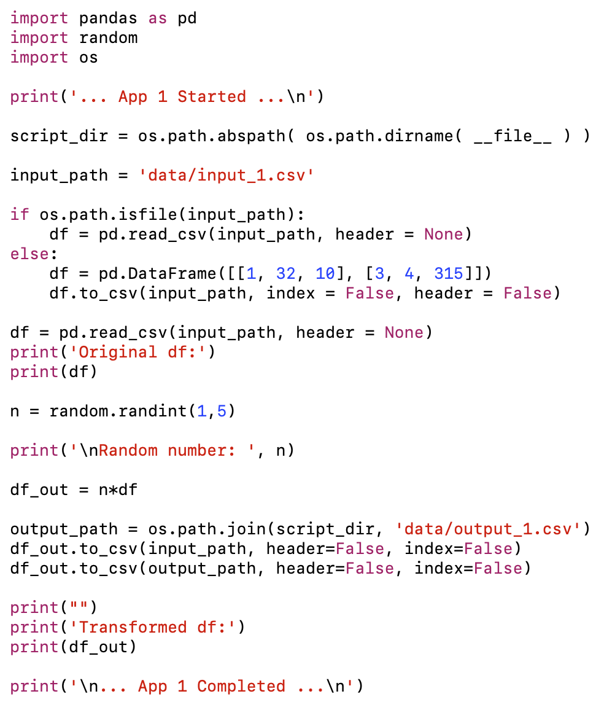
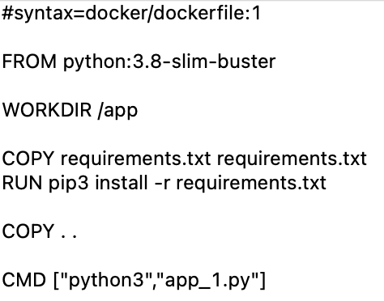
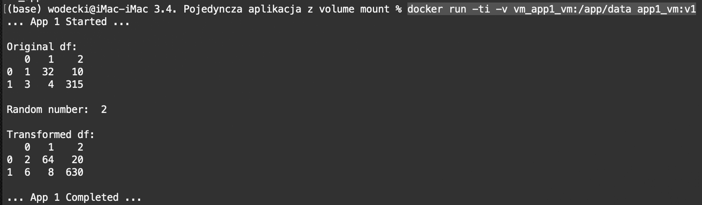
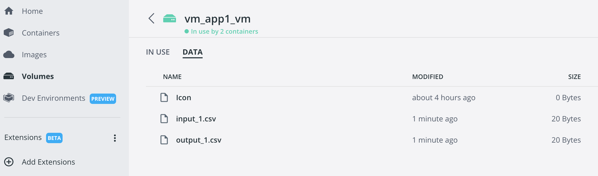
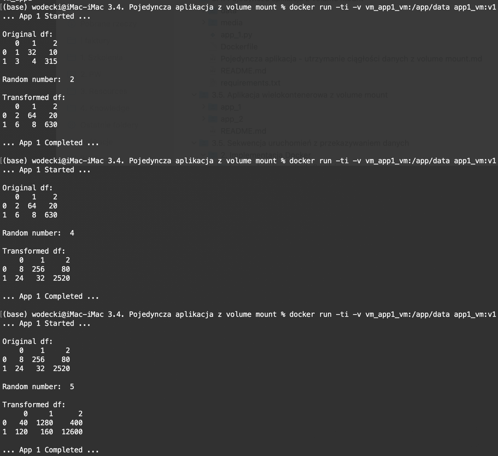

# Utrzymanie ciągłości pracy pojedyńczej aplikacji z `volume mount`

Często istnieje potrzeba współdzielenia danych pomiędzy różnymi kontenerami. Można wyróżnić trzy typowe sytuacje, w których może ona zaistnieć:

1. Wielokrotnie uruchamiamy ten sam kontener, i chcemy zapewnić ciągłość jego działania. Przykładowo, uruchomienie nr 2 korzysta z rezultatów uruchomienia nr 1 (dane z uruchomienia 1 nie znikają, ale są przekazywane na potrzeby kolejnego)
2. Mamy kilka działających równolegle kontenerów i chcemy, by wymieniały one pomiędzy sobą pliki.
3. Mamy kilka kontenerów uruchamianych w sekwencji i chcemy, by przekazywały one sobie wyniki operacji.

W poniższym przykładzie pokażemy, jak można zapewnić ciągłość działania pojedynczej aplikacji korzystając z mechanizmu **volume mount**.

## Nasza aplikacja

W naszym przykładzie wykorzystamy aplikację *app_1.py* realizującą prostą transformację ramki danych:

Zwróć uwagę na eksporty do pliku csv na końcu aplikacji: wynik obliczeń przekazujemy nie tylko do pliku `data/output_1.csv`, ale też pliku wejściowego `data/input_1.csv`. W efekcie, kolejne uruchomienia, przy poprawnie działającym mechanizmie zachowania ciągłości danych, powinny korzystać z wyników uruchomień poprzednich.

## Stworzenie obrazu

Obraz tworzymy w oparciu o plik Dockerfile:

Korzystamy w tym celu z komendy:

` docker build -t app1_vm:v1 .`

## Stworzenie współdzielonego woluminu

Funkcjonalność *volume mount* umożliwia stworzenie lokalnego, ale zarządzanego przez docker'a współdzielonego woluminu. Stwórzmy taki wolumen korzystając z komendy:

`docker volume create vm_app1`

Możesz teraz sprawdzić, np. korzystając z aplikacji Docker Desktop, że nie zawiera on żadnych danych.

## Sekwencyjne uruchamianie kontenerów z wykorzystaniem mechanizmu volume mount

Aby uruchomić kontener **z opcją synchronizacja danych z woluminem Docker**, w linii komend wpisz:

`docker run -ti -v vm_app1_vm:/app/data app1_vm:v1`

Efekt to nie tylko uruchomiony skrypt:

... ale też nowe dane w naszym wolumenie:

Kolejne uruchomienia kontenerów wykorzystują wyniki poprzednich:

## Scenariusze użycia

Wyżej wymieniony mechanizm możesz w szczególności zastosować w następujących sytuacjach:

### Produkcja

**Chcę zapewnić ciągłość działania mojej aplikacji**

... tak, aby kolejne uruchomienia kontenera z moją aplikacją mogły korzystać z wyników poprzednich uruchomień

Wykorzystuję w tym celu docker volume.

**Chcę, aby różne równolegle pracujące kontenery wymieniały wymieniały się danymi**

Wykorzystuję w tym celu docker volume.

**Chcę przechowywać dane wykorzystywane przez moje kontenery u dostawcy usług chmurowych**

Wykorzystuję w tym celu docker volume. 

## Przydatne źródła

Bardzo dobrą prezentację metod *bind mount* i *volume mount* znajdziesz w oficjalnej dokumentacji docker dostępnej [tutaj](https://docs.docker.com/storage/).