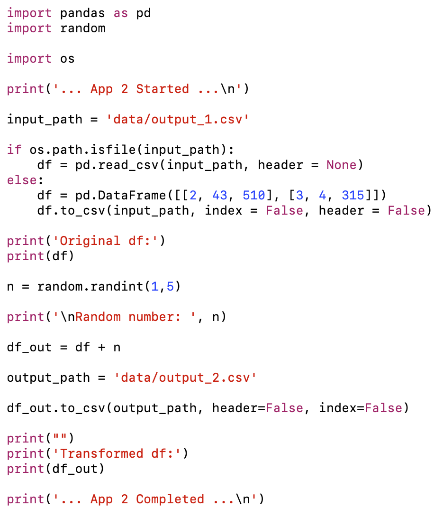
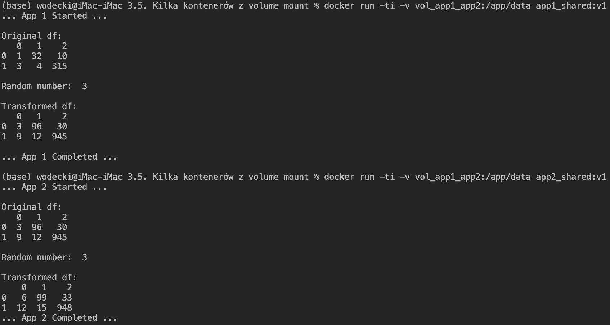

# Współdzielenie danych pomiędzy kontenerami z `volume mount`

W tej części naszego wykładu pokażemy, w jaki sposób można zapewnić wymianę danych pomiędzy **wieloma kontenerami** z wykorzystaniem mechanizmy **volume mount**.

## Stworzenie obrazów i uruchomienie poszczególnych kontenerów

W naszym przykładzie stworzymy i uruchomimy 2 kontenery: `app1_shared` i `app2_shared`.

Obie dokunują prostej transformacji danych zaczytanych z pliku zewnętrznego, przy czym **app2_shared jako wejście traktuje wynik działania app1_shared**:

Aby stworzyć obraz `app1`, w folderze `\app_1` uruchom w terminalu komendę:

`docker build -t app1_shared:v1 . `

Aby go uruchomić:

`docker run -ti app1_shared:v1`

Analogicznie, aby stworzyć obraz `app2`, w folderze `\app_2` uruchom w terminalu komendę:

`docker build -t app2_shared:v1 . `

Aby go uruchomić:

`docker run -ti app2_shared:v1`

## Stworzenie współdzielonego woluminu

Funkcjonalność *volume mount* umożliwia stworzenie lokalnego, ale zarządzanego przez docker'a współdzielonego woluminu. Stwórzmy taki wolumen korzystając z komendy:

`docker volume create vol_app1_app2`

## Uruchomienie poszczególnych kontenerów z funkcjonalnością wymiany danych

Aby uruchomić poszczególne aplikacje w trybie wymiany danych z wykorzystaniem mechanizmu volume mount:

1. W przypadku aplikacji `app1_shared` w linii komend uruchom:

`docker run -ti -v vol_app1_app2:/app/data app1_shared:v1`

2. W przypadku aplikacji `app2_shared` w linii komend uruchom:

`docker run -ti -v vol_app1_app2:/app/data app2_shared:v1`

Zauważ, że sekwencyjne uruchamianie tych aplikacji powoduje uwzględnianie wyników poprzednich obliczeń jako weściowych do kolejnych:

## Scenariusze użycia

Wyżej wymieniony mechanizm możesz w szczególności zastosować w następujących sytuacjach:

**Chcę zapewnić ciągłość działania mojej aplikacji**

... tak, aby kolejne uruchomienia kontenera z moją aplikacją mogły korzystać z wyników poprzednich uruchomień

Wykorzystuję w tym celu docker volume.

**Chcę, aby różne równolegle pracujące kontenery wymieniały wymieniały się danymi**

Wykorzystuję w tym celu docker volume.

**Chcę przechowywać dane wykorzystywane przez moje kontenery u dostawcy usług chmurowych**

Wykorzystuję w tym celu docker volume. 

## Przydatne źródła

Bardzo dobrą prezentację metod *bind mount* i *volume mount* znajdziesz w oficjalnej dokumentacji docker dostępnej [tutaj](https://docs.docker.com/storage/).