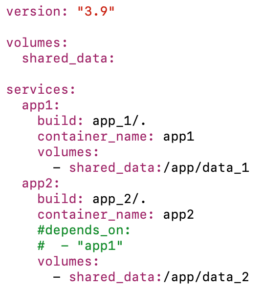
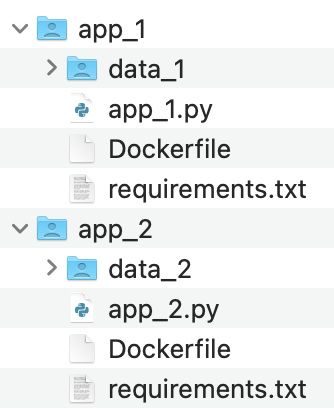
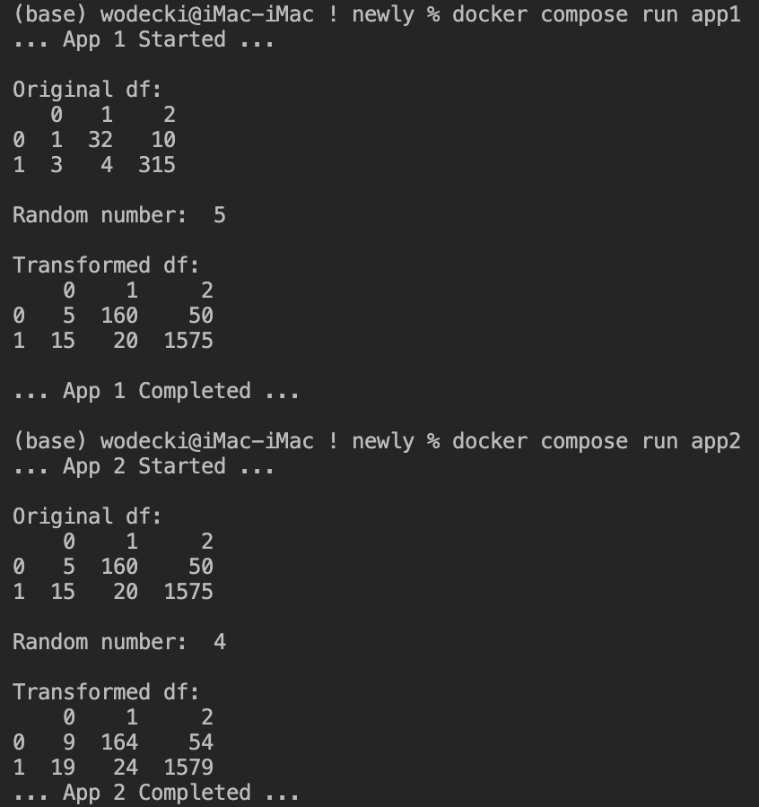
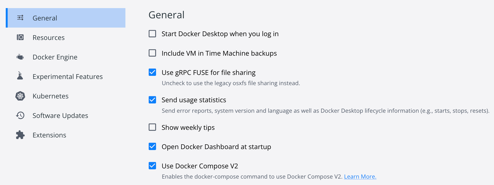

# Aplikacje wielokontenerowe

Docker umożliwia tworzenie aplikacji wielokontenerowych współdzielących ze sobą dane. 

Mogą być one uruchamiane niezależnie bądź sekwencyjne.

Do projektowania i uruchamiania takich aplikacji służy moduł **docker compose**, zaś specyfikacja konfiguracji przechowywana jest w pliku `docker-compose.yaml`.

W naszym przypadku plik ten ma następujący kształt:

Zwróć uwagę na:

1. Fakt, że skrypty aplikacji `app1` i `app2` korzystają z inaczej nazwanych katalogów, odpowiednio `/data_1` i `/data_2`
   
2. Na początku pliku `docker-compose.yaml` zdefiniowaliśmy współdzielony wolumin `shared_data` (o tej i innych mechanizmu wymiany plików pomiędzy kontenerami możesz przeczytać np. [tutaj](https://devopsheaven.com/docker/docker-compose/volumes/2018/01/16/volumes-in-docker-compose.html). 
3. W specyfikacji usług `app1` i `app2` wskazaliśmy mechanizm mapowania woluminu docker z woluminami poszczególnych kontenerów.

## Budowa i uruchomienie

Aby stworzyć i uruchomić taką aplikację, w linii komend uruchom: 

`docker compose up`

Aby uruchomić jedną z wybranych aplikacji:

`docker compose run app1` < uruchamia *app1*

`docker compose run app2` < uruchamia *app2*

W efekcie, wyniki sekwencyjnego uruchamiania usług pokazują, że dane propagowane są prawidłowo:

Aby uruchomić w trybie zwalniającym terminal (detached):

`docker compose up -d`

W takim przypadku, aby zatrzymać aplikacje:

​		`docker compose stop`

​		`docker compose down --volumes` < usuń też wszystkie współdzielone woluminy.

Aby sprawdzić listę aktywnych procesów docker compose:

`docker compose ps`

Jeśli w międzyczasie zmodyfikowała/eś pliki źródłowe (np. skrypty Python), przebuduj odpowiednie obrazy:

`docker compose build` 

## `docker compose` vs `docker-compose` 

**UWAGA:** w najnowszych wersjach Docker'a zaimplementowane moduł `compose` bezpośrednio w pakiecie. W efekcie, można go uruchamiać w formie `docker compose ...`.

W starszych wersjach korzystanie z tej usługi możliwe jest po zainstalowaniu osobnej biblioteki `docker-compose`, zaś uruchomienie wymaga wpisania `docker-compose ...` (< zwróć uwagę na znak `-` w środku). 

Możesz to też skonfigurować w ustawieniach Docker:

## Przydatne źródła

Dokumentację funkcjonalności docker compose znajdziesz [tutaj](https://docs.docker.com/compose/).

Bardzo dobry opis wymiany plików pomiędzy aplikacjami znajdziesz [tutaj](https://devopsheaven.com/docker/docker-compose/volumes/2018/01/16/volumes-in-docker-compose.html).
